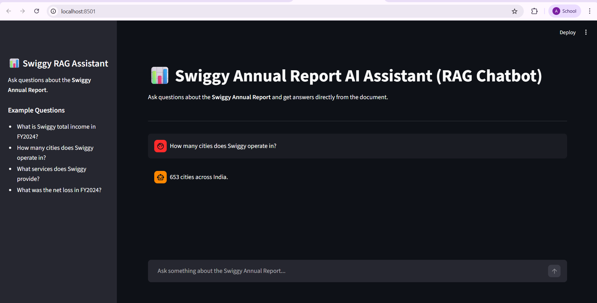

# Swiggy Annual Report RAG Chatbot

This project implements a Retrieval-Augmented Generation (RAG) system that answers questions based only on the Swiggy Annual Report.

## Dataset
Swiggy Annual Report FY 2023–2024  
Source: [data/swiggy_annual_report.pdf](data/swiggy_annual_report.pdf)

## Architecture

PDF → Chunking → Embeddings → Vector Database → Retrieval → LLM → Answer

## Technologies Used

- Python
- LangChain
- ChromaDB
- Sentence Transformers
- Groq (Llama 3.1)
- Streamlit

## Features

- Load Swiggy Annual Report PDF
- Split text into chunks
- Generate embeddings
- Store embeddings in Chroma Vector DB
- Retrieve relevant chunks using semantic search
- Generate answers using LLM
- Streamlit-based chatbot interface
- Displays supporting context

## How to Run

Install dependencies:

pip install -r requirements.txt

Run CLI version:

python rag_pipeline.py

Run Streamlit UI:

streamlit run app.py

## Example Questions

- What is Swiggy total income in FY2024?
- What services does Swiggy provide?
- How many cities does Swiggy operate in?
- What was Swiggy's net loss in FY2024?

## Demo

